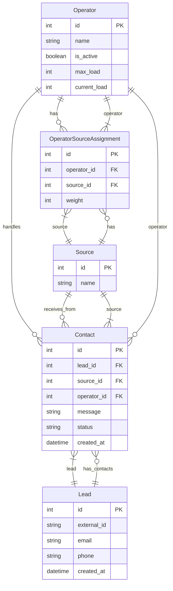

# mini-CRM

### Запуск (без docker-compose)
```bash
uvicorn server:app --reload --host 0.0.0.0 --port 8000
```

Документация **Swagger**: http://localhost:8000/docs

### Модель данных


```mermaid
erDiagram
    Operator {
        int id PK
        string name
        boolean is_active
        int max_load
        int current_load
    }

    Source {
        int id PK
        string name
    }

    OperatorSourceAssignment {
        int id PK
        int operator_id FK
        int source_id FK
        int weight
    }

    Lead {
        int id PK
        string external_id
        string email
        string phone
        datetime created_at
    }

    Contact {
        int id PK
        int lead_id FK
        int source_id FK
        int operator_id FK
        string message
        string status
        datetime created_at
    }

    Operator ||--o{ OperatorSourceAssignment : "has"
    Source ||--o{ OperatorSourceAssignment : "has"
    Operator ||--o{ Contact : "handles"
    Source ||--o{ Contact : "receives_from"
    Lead ||--o{ Contact : "has_contacts"
    
    OperatorSourceAssignment }|--|| Operator : operator
    OperatorSourceAssignment }|--|| Source : source
    Contact }|--|| Lead : lead
    Contact }|--|| Source : source
    Contact }o--|| Operator : operator
```